# Setting Up the Required Softwares

So for setting up a lab we would need a software to handle virtualization in our case we will be using VMWare's Workstation Pro which can be found here https://www.vmware.com/products/workstation-pro.html . Scrolling down on this page we will find the system requirments and the Operating systems it can be run on. Then there is a download now button which if you press you will transfered over to https://www.vmware.com/products/workstation-pro/workstation-pro-evaluation.html and here then you can select the OS you want to download the VMWare Workstation Pro for by clicking these buttons.

Clicking this would download the setup file for us opening that up first lets press next and then accept the user agreement by checking the checkbox and pressing next a few times we will have the VMWare Worstation Pro Installed for us now lets move forward to downloading the neccesary ISO files .

So here to setup lets first define the infrastructure of this lab we are gonna make this lab with around 6 computers and machines the OS i have choosen are :

1. Windows 10 x 3 machines 
2. Windows Server 2019
3. Kali Linux 2020.4 
4. Ubunutu 

So now lets start with downloading the Windows 10 and Windows Server 2019 files which we can find here. 

Windows 10 Enterprise : https://www.microsoft.com/en-us/evalcenter/evaluate-windows-10-enterprise
Windows Server 2019 :  https://www.microsoft.com/en-us/evalcenter/evaluate-windows-server-2019

And here select the ISO file and download them.

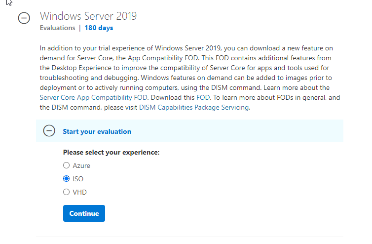

Then for Kali Linux which our penteration testing Operating System of choice you can also choose Parot OS if you prefer that but here on the link we can find the file download link for the Kali Linux 2020.4 machine.

https://www.offensive-security.com/kali-linux-vm-vmware-virtualbox-image-download/

Download the 64-bit Vmware version and it will need you to have a torrent downloader like utorrent or bittorent. 

Now for Ubuntu we can find the Ubunutu Desktoip 20.04.1 LTS version here. 

Link : https://ubuntu.com/download/desktop

and click the download button for it to download the iso file for us.

# Instalation and Domain Configuration

Now with all the virtual machines ISO files and VMWare files download lets move forward and install them on VMWare so we can use them for setting up our lab.

## Installing our Penetration Testing distribution : Kali Linux

So now that we have our Kali Linux downloaded for vmware. Lets go to the location there will be a .zip file so lets extract it at first to the same folder and then we will have the folder to work with the easiest way to install this is by clicking on the .vmx file and it will open up for us and be all setup 

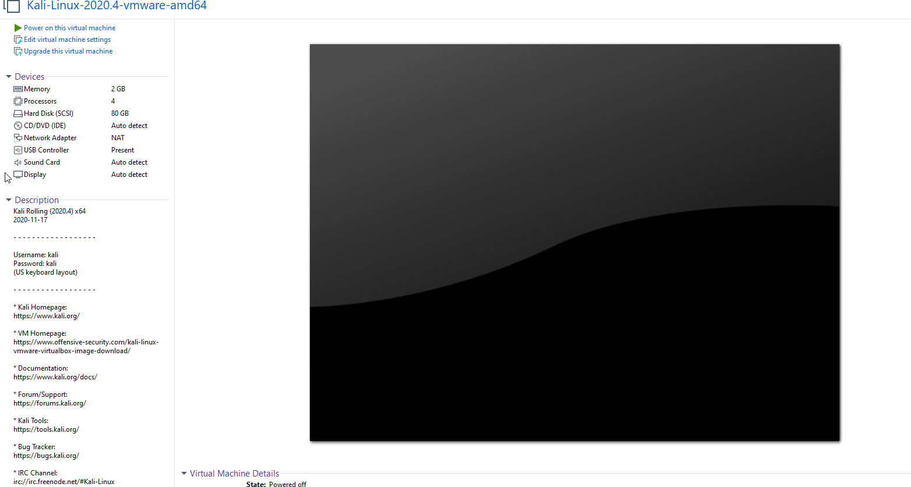

So once this is done we can now configure its resouce allocation and settings in the menu

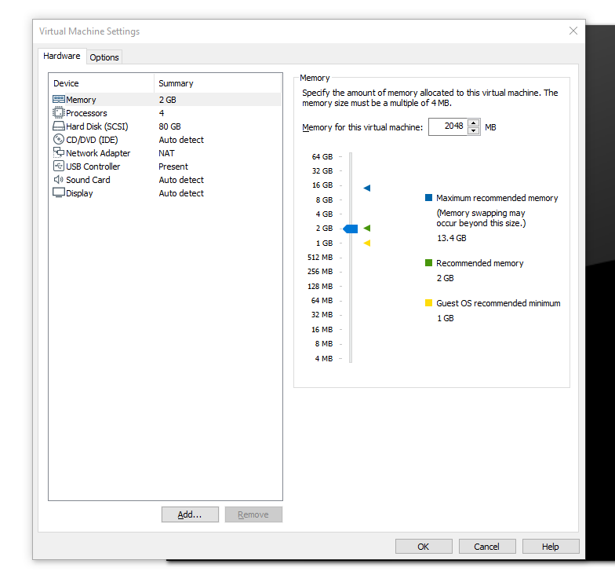

These are my current settings and you can ofcourse tweak them around according to your PC specifications and your requirements. and then we can start our kali machine by clicking the first option and then to login we can use the credentials kali:kali and we will be in there.

## Installing Ubuntu 

Now lets go to the File Menu and click on New Virtual Machine and then we will get our Machine Installation wizard and select the typical (recommended option) and press next.

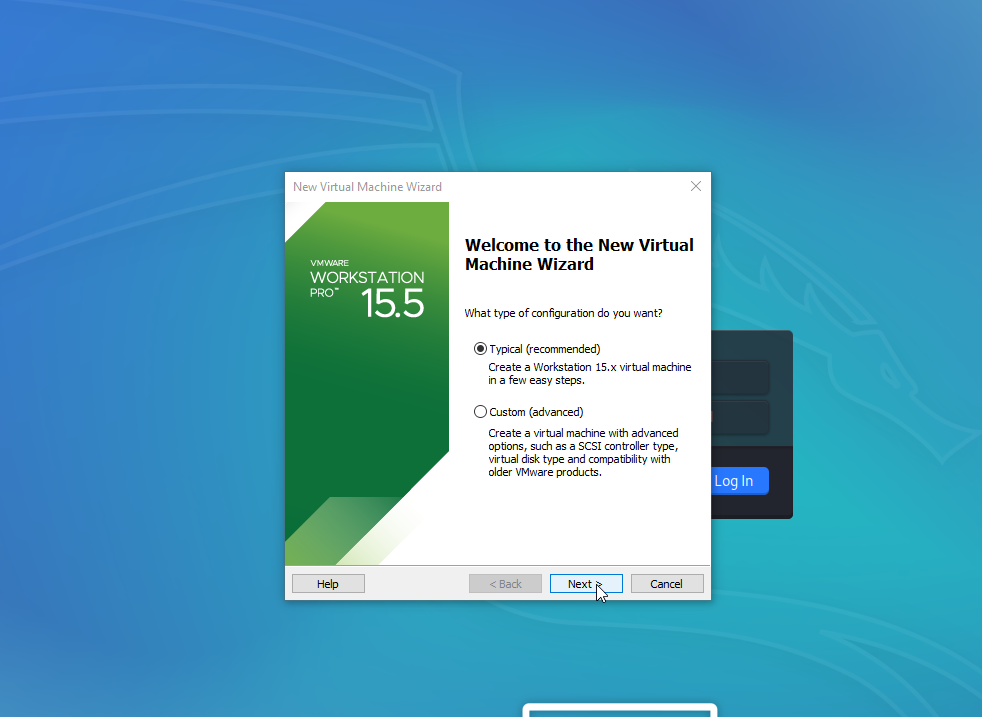

And now we have to select the ISO file here in the Installer Disk Image file section which we downloaded for Ubuntu. 

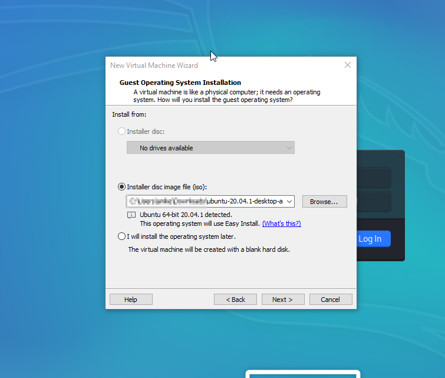

Then we can choose the username and password of our machine like below 

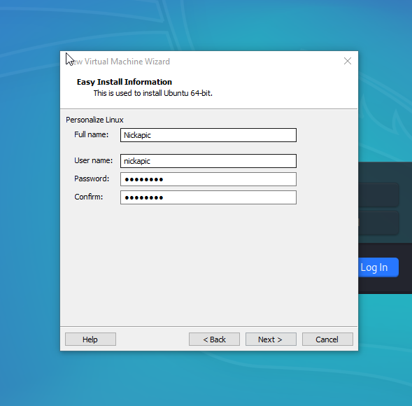

and then pressing next we can rename our server and so on and then we can choose a Maximum disk size for me i chose this to be 20GB and depending on your use case you can choose the option to either all the storage as one file or we can split the disk into multiple files, i choose the later option and then press finish.

Then we can start the virtual machine and it will check the disks at first which can take a little bit of time and then we will then be logged in and it will check the installed file and pop up the Welcome to Ubuntu wizard which is gonna install packages and copy some files for us which can again take some time and then we can login after all this is done using the credentials we set at first.

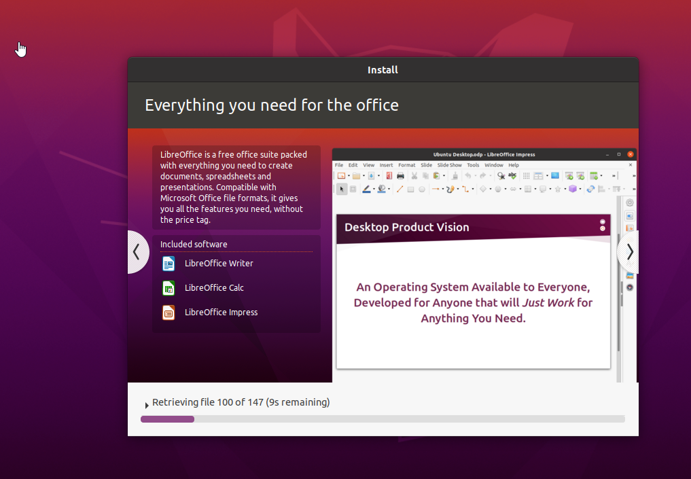

Then we can try downloading our tools in my case i downloaded net-tools so that i can use commands like ifconfig etc. and doing a simple Ifconfig we can see that the server is working and its IPaddress now to check connectivity what i wanted to do was ping this IP from our Kali Linux Machine

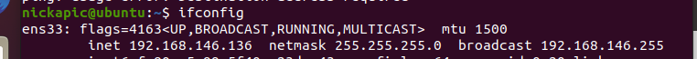

and then we can see the results of pinging the server here :

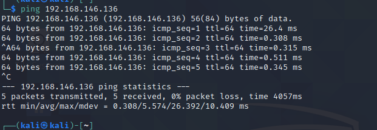

## Installing Windows Server and Setting Up our Domain Controller

So after we have our Windows Server and VMWare Workstation installed lets go to VMWare Workstation and then click the button create a new virtual machine 

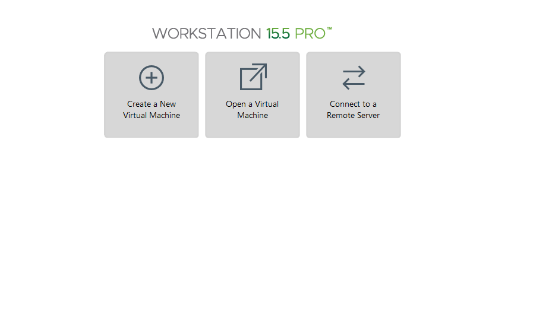

Now after clicking on it we will get a pop up for the wizard and we should just click next with the Typical(Recommended) option selected.

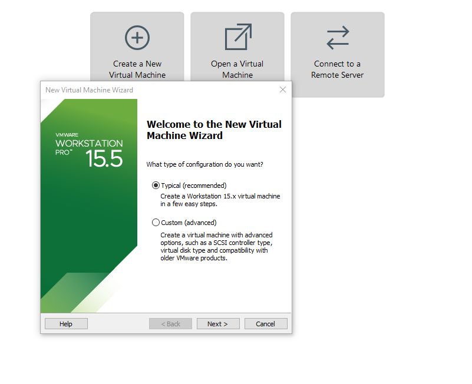

then like shown previously choose the downloaded file in the Use ISO Image section and press next and then we have to select the version of windows we have installed in most cases its already detected by VMWare but if not correct select it from Dropdown menu.

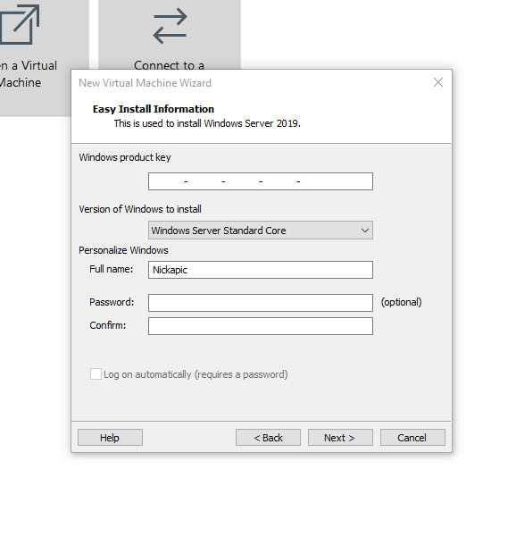

and then press next and uncheck the checkbox which says power on this virtual machine after creation as we still wanna make changes before we start which is mainly removing the Floppy Option in the Hardware tab as this will lead to issues when starting up some times.

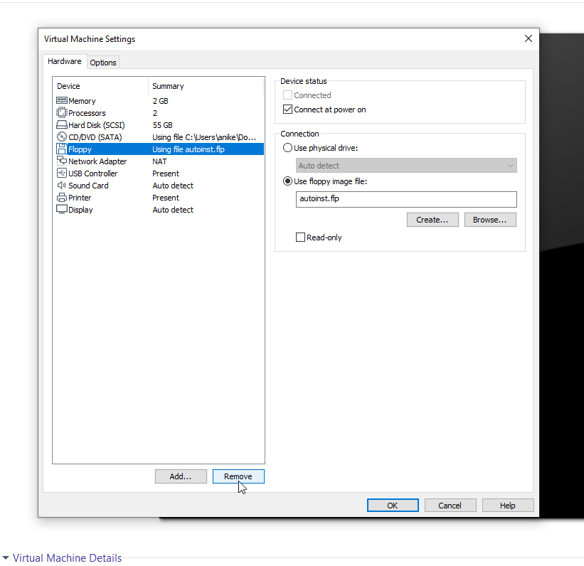

Here click on remove button and then our server is ready to boot up.

Then lets boot this up its gonna load up and it starts up with a boot up window like so :

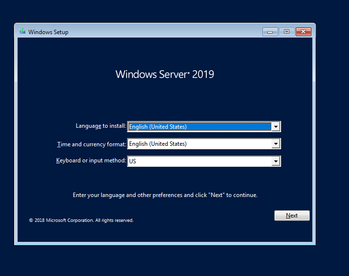

Here click next and press Install Now and for the Operating System we wanna install we will select the Standard Evaluation Desktop Experience and then after select agree to the terms of service press Custom Windows Install and select the disk we allocated to our windows 

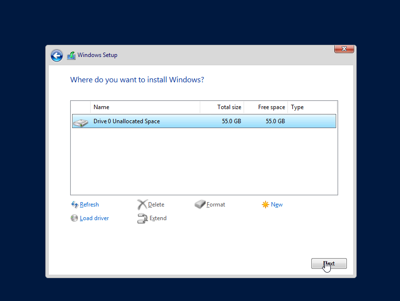

and then after clicking next we will start Installing Windows and will hve to wait for a bit as this process can take some time.

And after installing the system will restart itself and now after rebooting its gonna give us a pop up about cusotmizing settings where its gonna ask us to set a password for the buil-in adminsitrator and as this is a test enviornment we can put whatever we like :

I am gonna with this set of credentials 
Administrator:SecureP@ssword!1

So our password for the Domain Controller is going to be : SecureP@ssword!1

and to press ctrl+alt+delete on virtual machines we have to use the drop down menu.

Now lets login with the password we just set and by default the Server Manager Dashboard will open up for us .

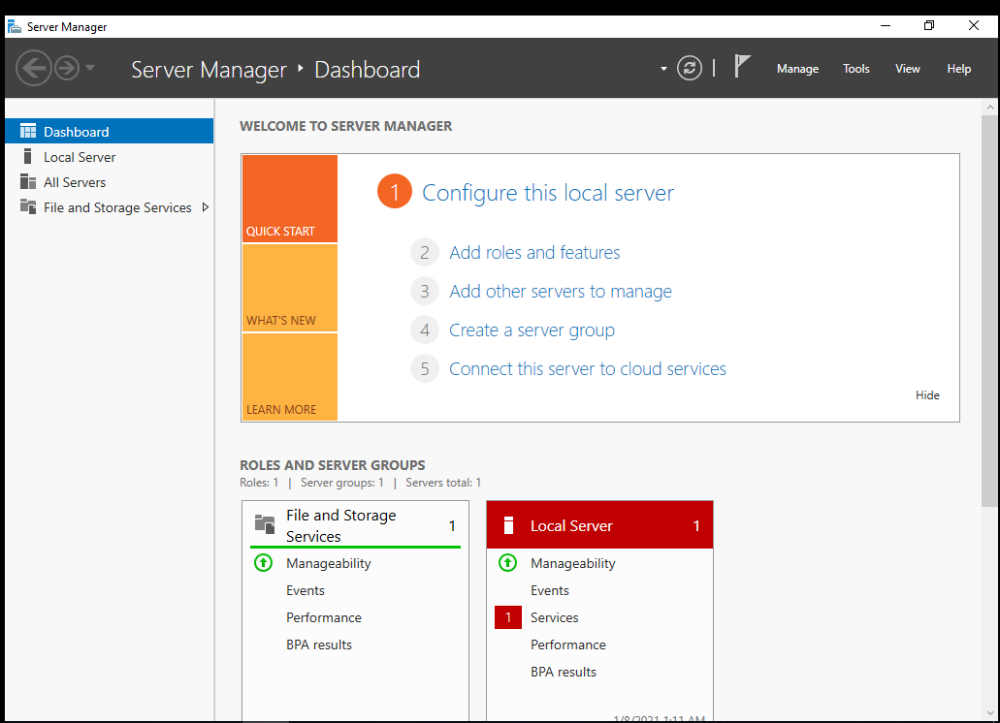

Before setting up the DC lets change its name and make it more vissible/noticable i will name my machines with a Star Wars  theme to kind of have a harmony so you can do so as well by seraching the view your pc name in the search bar like so and then clicking on the Rename this PC option and changing the name in the field.

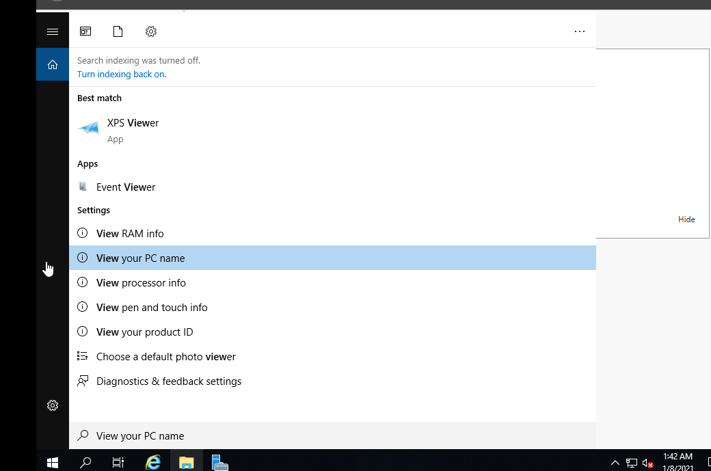

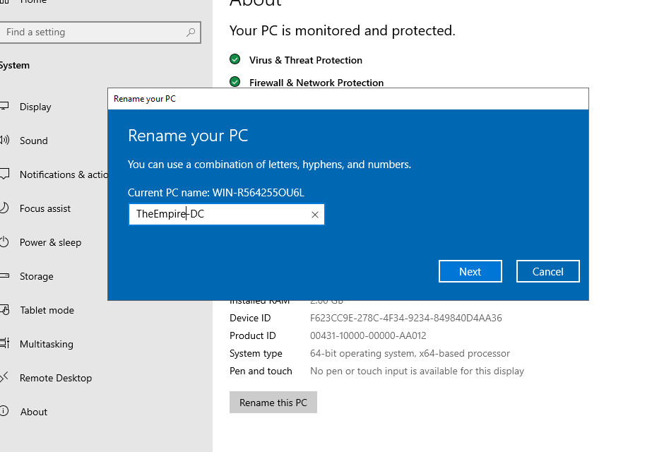

And then again we would need to restart our PC and login again now its time to customize our Domain Controller and making it a Domain Controller and now in Server Dashboard lets go to Manage tab and click on the Add roles and features button and now in the setup installer file we have to just press next until we get the Server Roles section where we have to then select the Active Directory Domain Services option and add that feature and then after pressing next a few times again we will be in the confirmation tab where we just press the Install button.

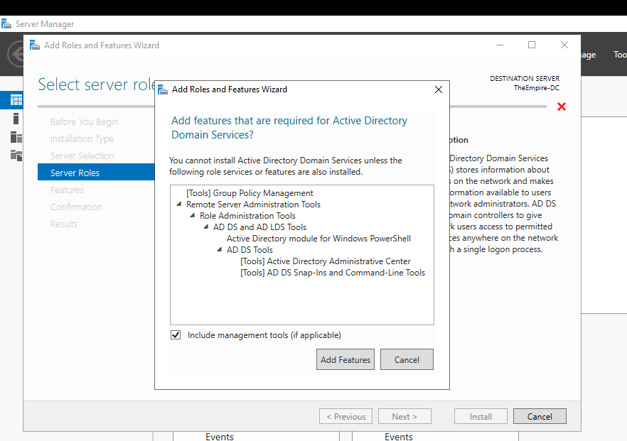

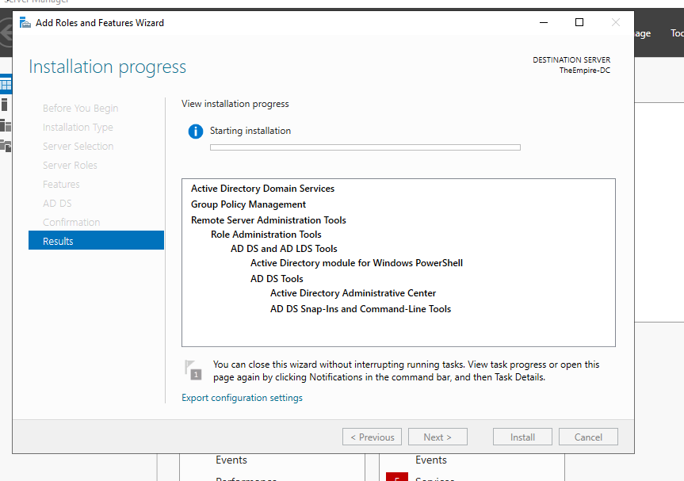

and after its done lets now close this installation window and click on the Flag(Notification) Icon where we then will click on the Promote this erver to a Domain COntroller button to make this our Domian Controller and now we will get the Deployment Configuration Window where we can select a few options in our we want to make our server a Domain COntroller of a Forest so we click the Add a new Forest option and we can then name this Empire.local normally the naming standard can go to stuff like Companyname.corp, Corp.local , etc. 

Then we need to set another password for our DC which in my case i am choosing : Iamsecure!1

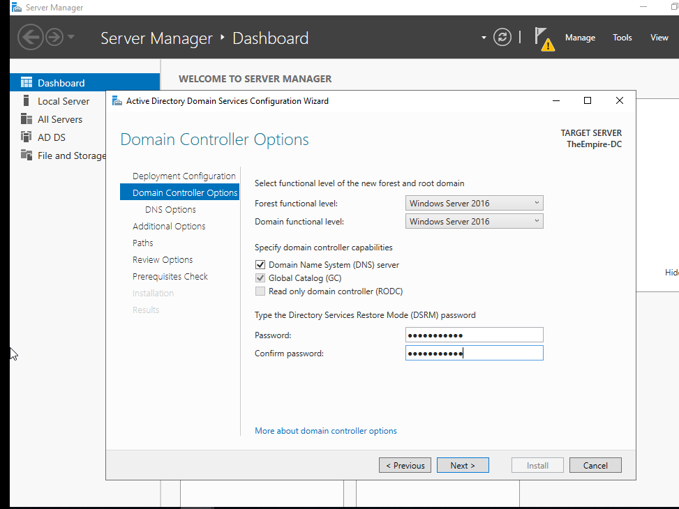

Now we will just have to click next like 5 times until we get to the Prerequisites Check section this will basicallytt give us default settings for the Domain Controller and now at the Prerequisites Check section press install which will install all the things we will need to set up our DC and our machine will now reboot itself.

## Installing Windows machine and connecting to the Domain

So now that we have our domain setup lets give this Domain Some machines and some users lets first download our machines you can replicate this process for all 3 Computers i will go through it with one machine 