# Setting Up the Required Softwares

So for setting up a lab we would need a software to handle virtualization in our case we will be using VMWare's Workstation Pro which can be found here https://www.vmware.com/products/workstation-pro.html . Scrolling down on this page we will find the system requirments and the Operating systems it can be run on. Then there is a download now button which if you press you will transfered over to https://www.vmware.com/products/workstation-pro/workstation-pro-evaluation.html and here then you can select the OS you want to download the VMWare Workstation Pro for by clicking these buttons.

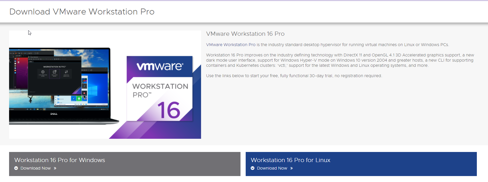

Clicking this would download the setup file for us opening that up first lets press next and then accept the user agreement by checking the checkbox and pressing next a few times we will have the VMWare Worstation Pro Installed for us now lets move forward to downloading the neccesary ISO files .

So here to setup lets first define the infrastructure of this lab we are gonna make this lab with around 6 computers and machines the OS i have choosen are :

1. Windows 10 x 3 machines 
2. Windows Server 2019
3. Kali Linux 2020.4 
4. Ubunutu 

So now lets start with downloading the Windows 10 and Windows Server 2019 files which we can find here. 

Windows 10 Enterprise : https://www.microsoft.com/en-us/evalcenter/evaluate-windows-10-enterprise
Windows Server 2019 :  https://www.microsoft.com/en-us/evalcenter/evaluate-windows-server-2019

And here select the ISO file and download them.

Then for Kali Linux which our penteration testing Operating System of choice you can also choose Parot OS if you prefer that but here on the link we can find the file download link for the Kali Linux 2020.4 machine.

https://www.offensive-security.com/kali-linux-vm-vmware-virtualbox-image-download/

Download the 64-bit Vmware version and it will need you to have a torrent downloader like utorrent or bittorent. 

Now for Ubuntu we can find the Ubunutu Desktop 20.04.1 LTS version here. 

Link : https://ubuntu.com/download/desktop

and click the download button for it to download the iso file for us.

# Instalation and Domain Configuration

Now with all the virtual machines ISO files and VMWare files download lets move forward and install them on VMWare so we can use them for setting up our lab.

## Installing our Penetration Testing distribution : Kali Linux

So now that we have our Kali Linux downloaded for vmware. Lets go to the location there will be a .zip file so lets extract it at first to the same folder and then we will have the folder to work with the easiest way to install this is by clicking on the .vmx file and it will open up for us and be all setup 

So once this is done we can now configure its resouce allocation and settings in the menu

These are my current settings and you can ofcourse tweak them around according to your PC specifications and your requirements. and then we can start our kali machine by clicking the first option and then to login we can use the credentials kali:kali and we will be in there.

## Installing Ubuntu 

Now lets go to the File Menu and click on New Virtual Machine and then we will get our Machine Installation wizard and select the typical (recommended option) and press next.

And now we have to select the ISO file here in the Installer Disk Image file section which we downloaded for Ubuntu. 

Then we can choose the username and password of our machine like below 

and then pressing next we can rename our server and so on and then we can choose a Maximum disk size for me i chose this to be 20GB and depending on your use case you can choose the option to either all the storage as one file or we can split the disk into multiple files, i choose the later option and then press finish.

Then we can start the virtual machine and it will check the disks at first which can take a little bit of time and then we will then be logged in and it will check the installed file and pop up the Welcome to Ubuntu wizard which is gonna install packages and copy some files for us which can again take some time and then we can login after all this is done using the credentials we set at first.

Then we can try downloading our tools in my case i downloaded net-tools so that i can use commands like ifconfig etc. and doing a simple Ifconfig we can see that the server is working and its IPaddress now to check connectivity what i wanted to do was ping this IP from our Kali Linux Machine

and then we can see the results of pinging the server here :

## Installing Windows Server and Setting Up our Domain Controller

So after we have our Windows Server and VMWare Workstation installed lets go to VMWare Workstation and then click the button create a new virtual machine 

Now after clicking on it we will get a pop up for the wizard and we should just click next with the Typical(Recommended) option selected.

then like shown previously choose the downloaded file in the Use ISO Image section and press next and then we have to select the version of windows we have installed in most cases its already detected by VMWare but if not correct select it from Dropdown menu.

and then press next and uncheck the checkbox which says power on this virtual machine after creation as we still wanna make changes before we start which is mainly removing the Floppy Option in the Hardware tab as this will lead to issues when starting up some times.

Here click on remove button and then our server is ready to boot up.

Then lets boot this up its gonna load up and it starts up with a boot up window like so :

Here click next and press Install Now and for the Operating System we wanna install we will select the Standard Evaluation Desktop Experience and then after select agree to the terms of service press Custom Windows Install and select the disk we allocated to our windows 

and then after clicking next we will start Installing Windows and will hve to wait for a bit as this process can take some time.

And after installing the system will restart itself and now after rebooting its gonna give us a pop up about cusotmizing settings where its gonna ask us to set a password for the buil-in adminsitrator and as this is a test enviornment we can put whatever we like :

I am gonna with this set of credentials 
Administrator:SecureP@ssword!1

So our password for the Domain Controller is going to be : SecureP@ssword!1

and to press ctrl+alt+delete on virtual machines we have to use the drop down menu.

Now lets login with the password we just set and by default the Server Manager Dashboard will open up for us .

Before setting up the DC lets change its name and make it more vissible/noticable i will name my machines with a Star Wars  theme to kind of have a harmony so you can do so as well by seraching the view your pc name in the search bar like so and then clicking on the Rename this PC option and changing the name in the field.

And then again we would need to restart our PC and login again now its time to customize our Domain Controller and making it a Domain Controller and now in Server Dashboard lets go to Manage tab and click on the Add roles and features button and now in the setup installer file we have to just press next until we get the Server Roles section where we have to then select the Active Directory Domain Services option and add that feature and then after pressing next a few times again we will be in the confirmation tab where we just press the Install button.

and after its done lets now close this installation window and click on the Flag(Notification) Icon where we then will click on the Promote this erver to a Domain COntroller button to make this our Domian Controller and now we will get the Deployment Configuration Window where we can select a few options in our we want to make our server a Domain COntroller of a Forest so we click the Add a new Forest option and we can then name this Empire.local normally the naming standard can go to stuff like Companyname.corp, Corp.local , etc. 

Then we need to set another password for our DC which in my case i am choosing : Iamsecure!1

Now we will just have to click next like 5 times until we get to the Prerequisites Check section this will basicallytt give us default settings for the Domain Controller and now at the Prerequisites Check section press install which will install all the things we will need to set up our DC and our machine will now reboot itself.

## Installing Windows machine and connecting to the Domain

So now that we have our domain setup lets give this Domain Some machines and some users lets first download our machines you can replicate this process for all 3 Computers i will go through it with one machine here now we basically repeat the same steps we took in installing the Windows Server by First opening the menu by clicking the create a new VM option then pressing the Typical setup and then connecting our downloaded iso file and then selectng our OS as for me sometimes 

Then in the instal wizard we press next -> Install Now -> Accept The License -> Custom Install and then let it install itself and then we let it install itself and then it will restart itself.

And lets select our region and our keyboard layout.

And then we will come to this page and here we can choose the Domain Join instead , when it says sign in with Microsoft.

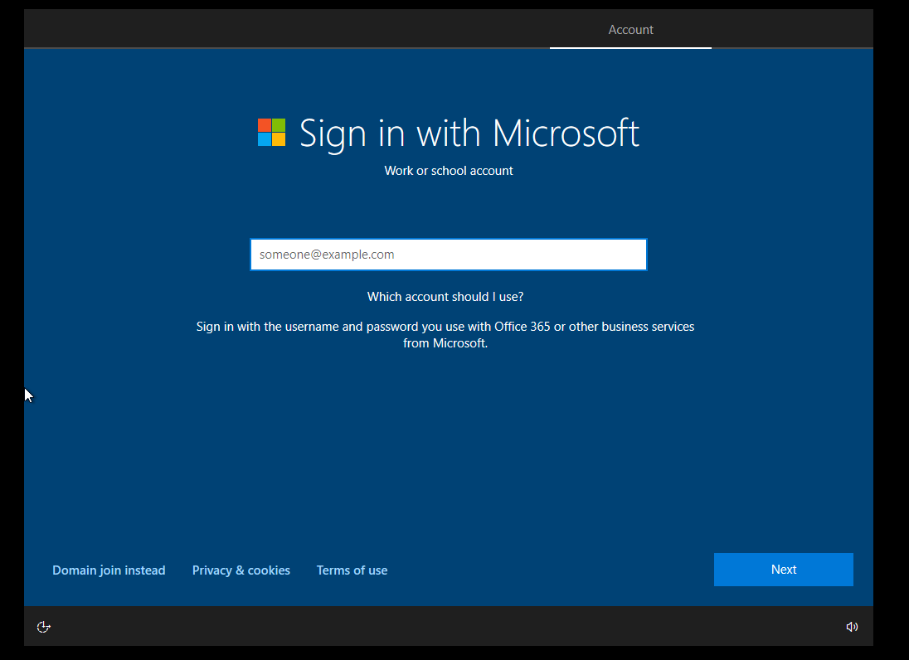

And then we will have to choose the Username and password for this user i will go with the username DarthVader and password Empire1sBack.

Then you would need to choose and set up 3 security questions you can choose whatever and now after this for the privacy settings for your device we can disable all of them and press accept and then for letting crotona help we will set that to not now.

And then its gonna get everything ready for us and when its boots up and then we should go to the file explorer and click on the Network tab and then click on the Network Discovery where we will have to click on Turn On network discovery and file sharing.

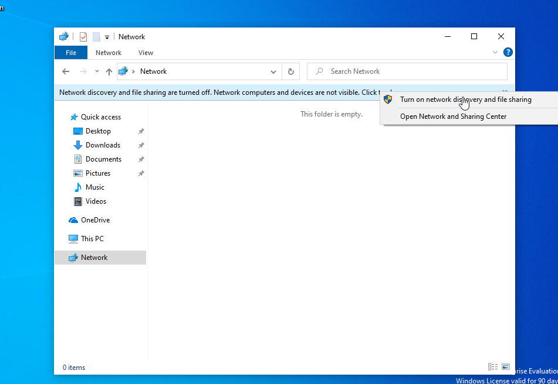

and then we click on Yes,Turn on network discovery and file sharing for all public networks.

and then we can rename the PC which will help us identify the system i renamed this one to DeathStar and here its the same process as the server so you can check the steps there and then restart our machine now.

# Adding Users to Our Domain Controllers

Now we will need to add users to our Domain Controller lets boot up our Windows Server 2019 and then enter our password to login which is SecureP@ssword!1 and then the Server DSashboard will pop up for us in there we should click the the Topls tab and select the Add Users and Roles section.

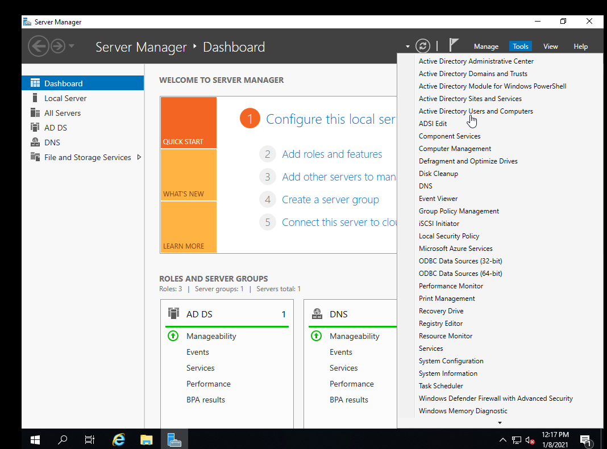

Then here in the Wizard lets traverse and open the Empire.local dropdown menu and select the Users option :

and then right click in the wizard and select the new -> User option which will give us a pop up for making a new user.

I named my user Anakin Skywalker like below :

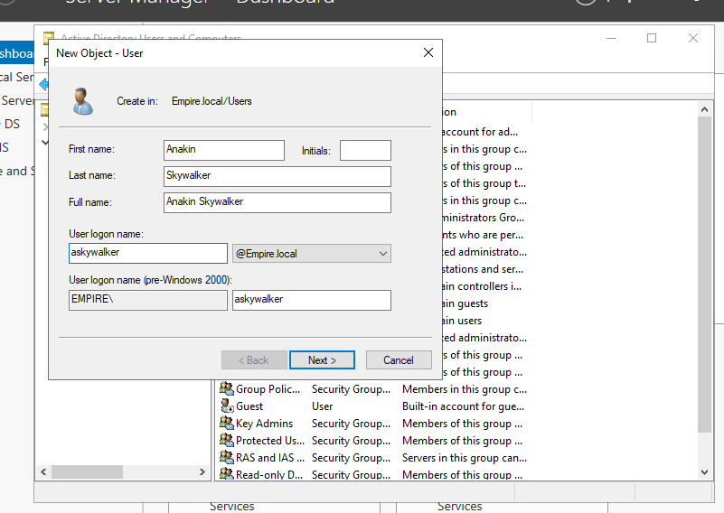

and then we would need to set the password for this user and then here uncheck the user must change password at next logon and click on the Password Never Expires checkbox.

G00dpassw0rd is the password i chose.

Now lets make a Service Account and a Administrator account.For which we can copy the Administrator User in the Users wizard we had open and then we will get another wizard like before to set the name so lets set the names here. Mine is configured like below. 

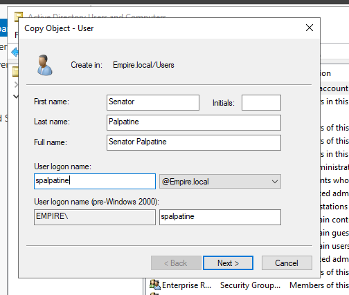

The password i chose for him was Th3D4rkSide and with the same policy of password never expiring.

And then with the 3rd user lets copy our Previous Palpitine user and make this our SQLDatabase user .

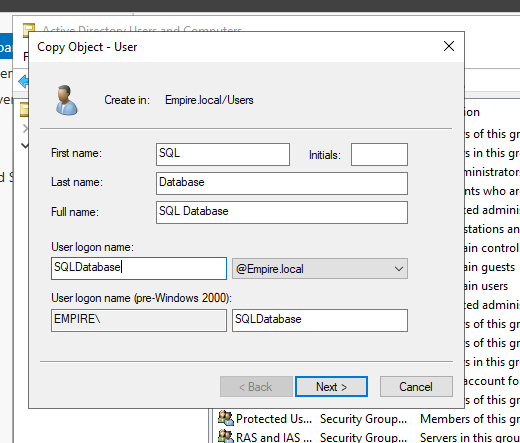

Lets for this use the password : Password!1234

Now lets also configure it with a common thing which many domains have for there service accounts. So lets right click on the SQL Database user and select the Properties option and in the Description add a comment In case you forget : Password!1234 and then click apply and press okay.

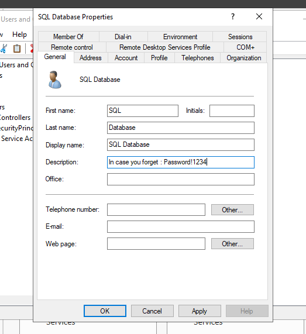

and then lets make a share which we can do by pressing at the File and Storage Services tab which is in the Left Side of the Server Manager Dashboard and then go to the Shares dropdown.

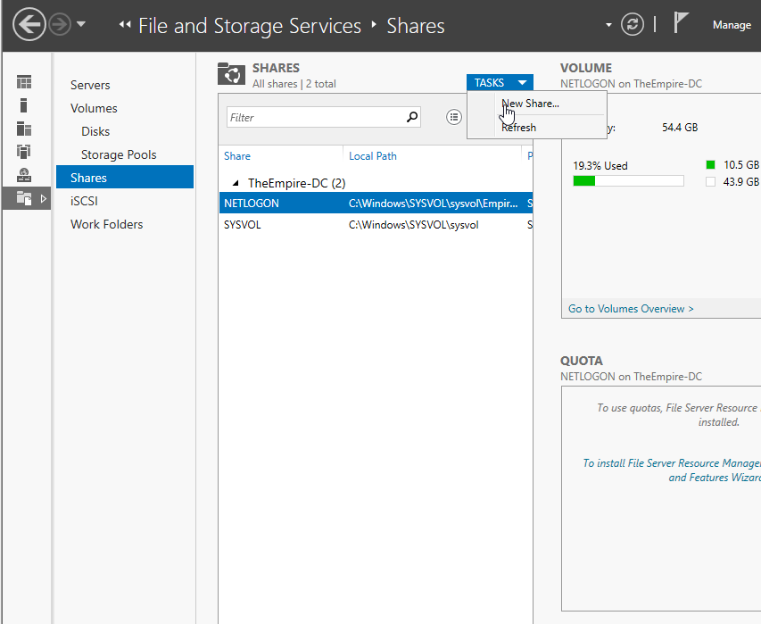

and then click on the Tasks dropdown menu and click on the New Share option and then in the popup lets click Next 2 times after which we can name our share MemoryCore and press Next again and then press next 3 times and clicking on the create button.

Now lets boot up our Windows Machine and connect it to the Domain and also make a folder to connect to.

So for this we would need to first get the IP address of our Domain Controller. So fgor this lets boot up our Domain Controller get the the ip address by going to the cmd and typing ipconfig.

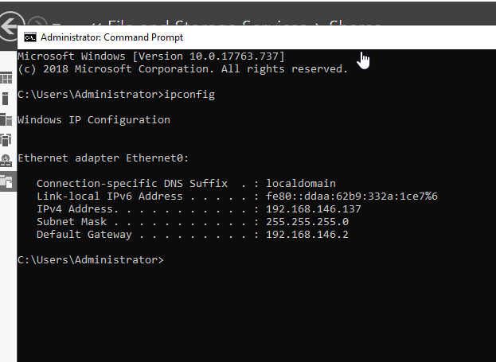

192.168.146.137 is my IP address for this.

For the Share lets make a folder called Share in the C folder of our Windows 10 Enterprise machine.

Here now on this folder right click and select the Properties option in here then go to the Sharing tab.

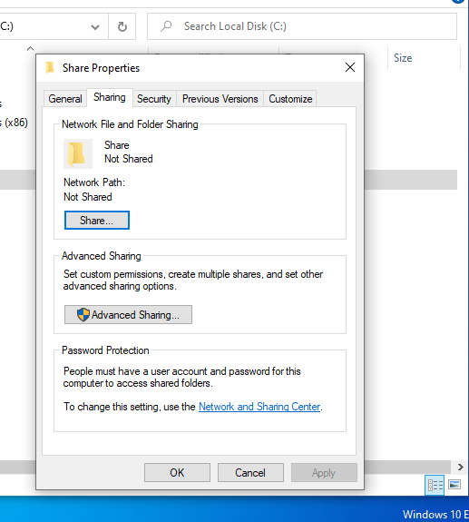

and now here click on the Share button again.

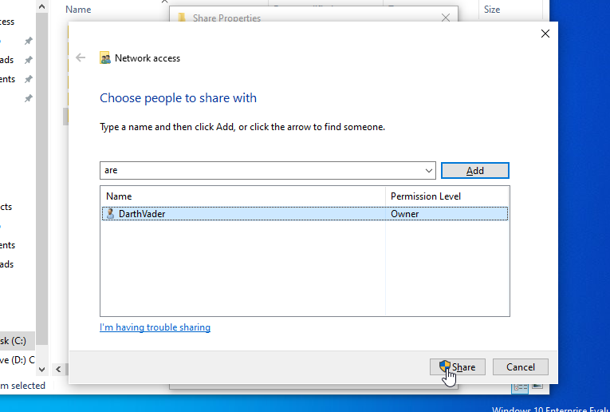

and then click on the done button.

Now lets connect our seleves to the Domain for that lets go on to the network prefences tab like so.

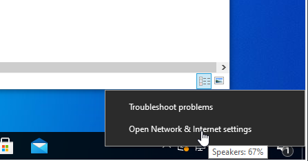

and then click at the Change Adapter Options option and then here in the Ethernet0 adapter lets right click and pres on the properties option.

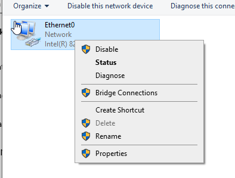

and then lets double click on the Internet Protocol Version 4 option which will then pop up a window here we enter the IP of our Domain Controller and choose the options as shown below.

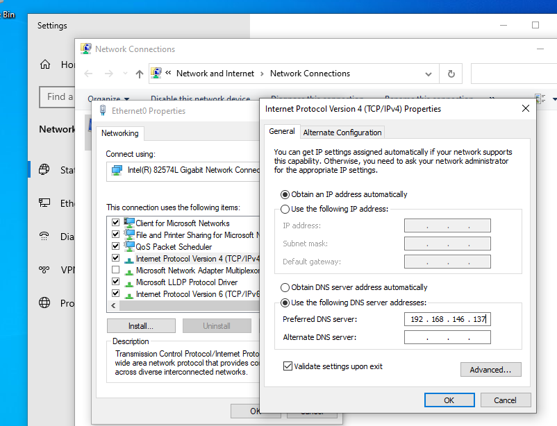

and then press okay now lets go to the search bar and search for the word domain and select the option Access Word or School and then click on the connect button and press the Join this device to a local Active Directory domain option in the popup 

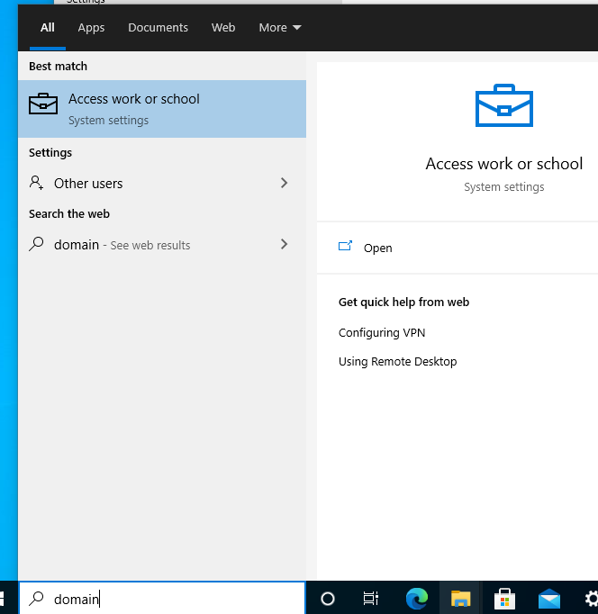

and now lets put in the Domain Name we choose in the Join a Domain pop up. Put the Empire.local Domain name and then it will ask for us a username and password.

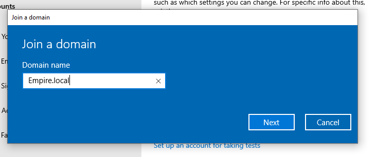

and then lets enter the password for the Administrator user of the domain (SecureP@ssword!1) and then lets click on the Skip button now lets restart our machine and try to login with the users we made on the Domain Controller.

And now if in the boot up screen if you click on the Other User button in the bopttom left we can login to the askywalker user we made on the Domain Controller and it works we can now login as Anakin Skywalker.

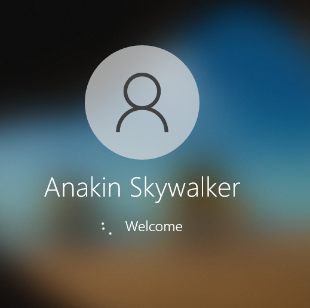

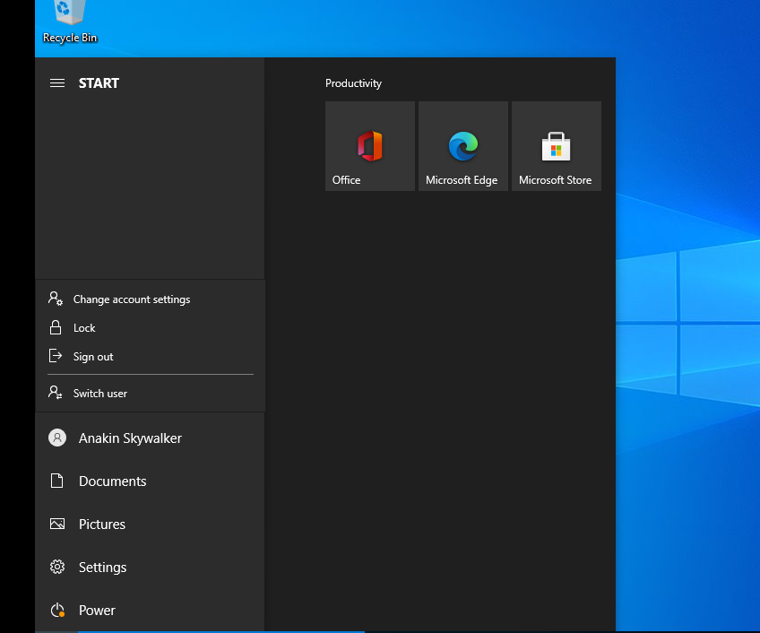

# Proof of Connection between the machines

So we can already prove that the machines in the Windows Domain are connected as we can login to the users we defined in the Domain Controller in any of those machines and then to show connection with The Ubuntu server which we plan to make our web server . It is very simple to do with python3 for this you can use any project you wanna host on here i will use a simple template to host on this server. 

We choose our templates from here : https://html5up.net/ we chosse the Paradign Shift tempalte you can click on the Free download button then we can cd to the Download folder and unzip the html5 zip file like so.

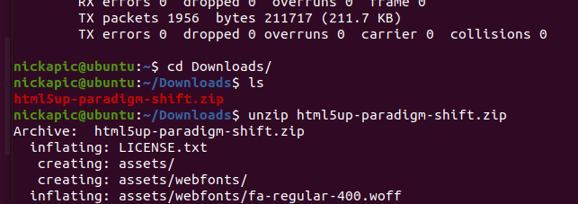

And by traversing to that IP which you can get by doing ifconfig on the machine and traversing to the IP we can see the template we just put in place.

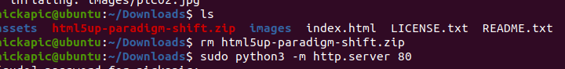

and now we can see that the connections have been established between the machines.